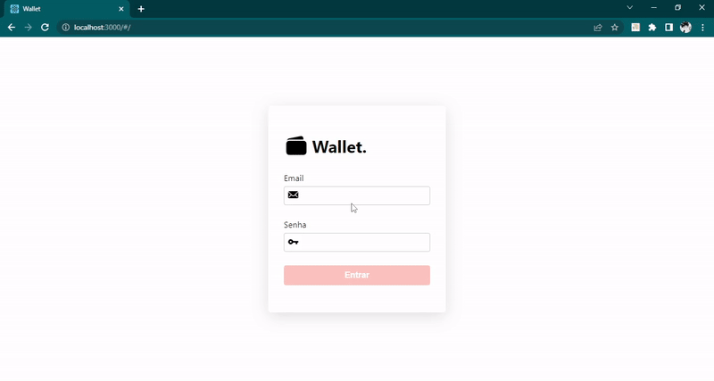
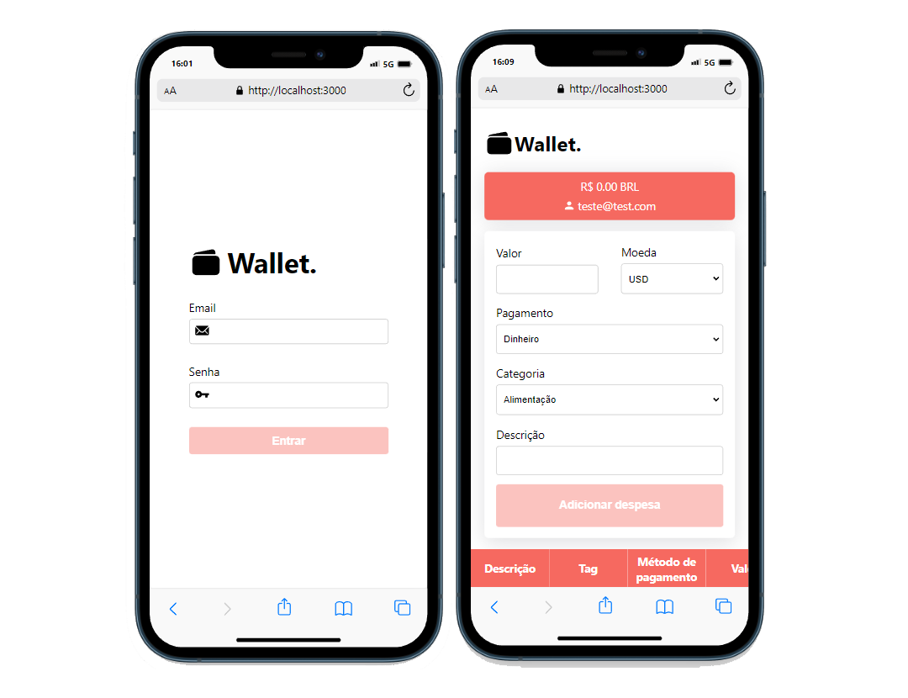
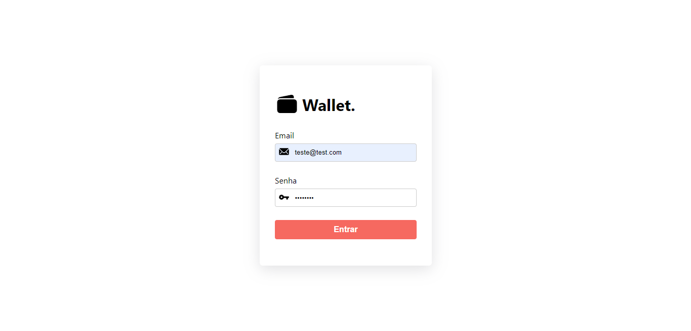
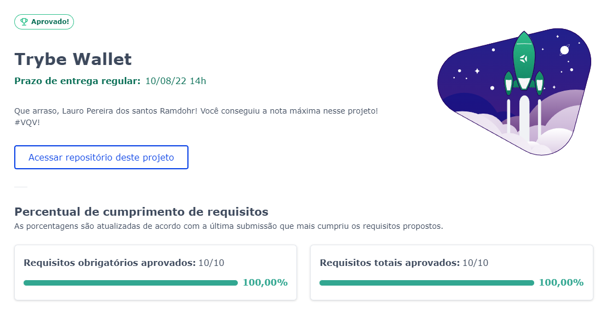

# :credit_card: Wallet

## Acesse meu projeto <a href="https://lauropera.github.io/wallet/">AQUI</a>

## :satellite: Desenvolvimento

Projeto desenvolvido na <a href="https://betrybe.com/" target="_blank">Trybe</a> durante o módulo de Front-End!

Nesse projeto desenvolvemos uma aplicação para controle de gastos. Colocamos em prática o aprendizado em Redux para salvar o estado de nossa aplicação de maneira global, podendo acessá-lo em qualquer parte do código. Também consultamos uma API para receber a cotação de moedas para fazer sua conversão na tabela.

## :hammer_and_wrench: Tecnologias

* HTML
* CSS
* JavaScript
* React.js
* React Router
* Redux

# :iphone: Mobile

# :camera: Screenshots

## :heavy_check_mark: Nota

