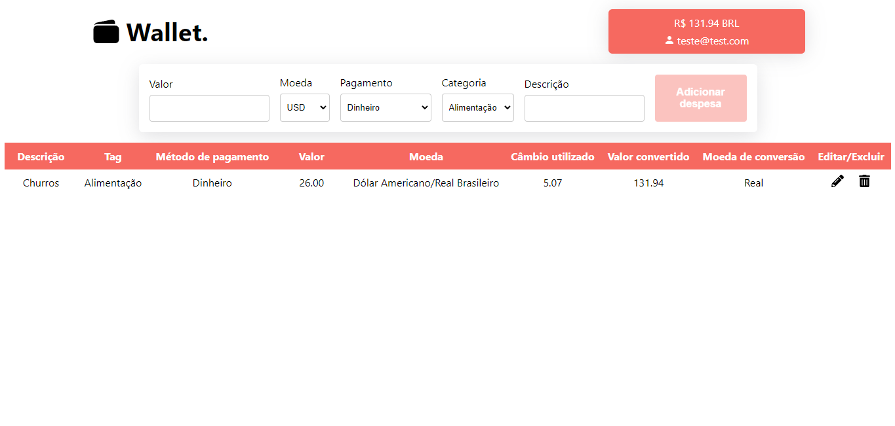

# 💳 Wallet


## Acesse o projeto clicando <a href="https://lauropera.github.io/wallet/">AQUI</a>

<br />

## 📡 Desenvolvimento

Projeto desenvolvido na <a href="https://betrybe.com/" target="_blank">Trybe</a> durante o módulo de Front-End!

Nesse projeto desenvolvemos uma aplicação para controle de gastos. Colocamos em prática o aprendizado em Redux para salvar o estado de nossa aplicação de maneira global, podendo acessá-lo em qualquer parte do código. Também consultamos uma API para receber a cotação de moedas para fazer sua conversão na tabela.

<br />

## ⚙️ Tecnologias

* HTML
* CSS
* JavaScript
* React.js
* React Router
* Redux

<br />

## 📚 Documentação

  <details>
    <summary>Instalação e execução</summary>
    <br />

- Faça o fork do repositório:
  Tutorial [AQUI](https://github.com/UNIVALI-LITE/Portugol-Studio/wiki/Fazendo-um-Fork-do-reposit%C3%B3rio)
- Abra seu terminal e navegue até a pasta onde preferir alocar o projeto.

- Clone o repositório:

  ```sh
    git clone git@github.com:"SeuNomeNoGitHub"/wallet.git
  ```

- Apos ter o repositório clonado em sua maquina, execute este comando para acessar a parta do projeto:

  ```sh
    cd wallet
  ```

- Dentro da pasta do projeto, execute o comando abaixo para instalar as dependências do projeto:

  Caso utilize o npm:

  ```sh
    npm install
  ```

  Caso utilize o yarn:

  ```sh
    yarn install
  ```

- Dentro da pasta do projeto, execute o comando abaixo para iniciar o servidor do projeto:

      Caso utilize o npm:

      ```sh
        npm start
      ```

      Caso utilize o yarn:

      ```sh
        yarn start
      ```

  O aplicativo sera executado em modo de desenvolvimento.
  Abrindo na porta padrão que o React usa: <http://localhost:3000/> em seu navegador.

    </details>
  <br />

# 📱 Mobile


<br />

# 📷 Screenshots




#

<div>
  <p align="center">🍐</p>
</div>
